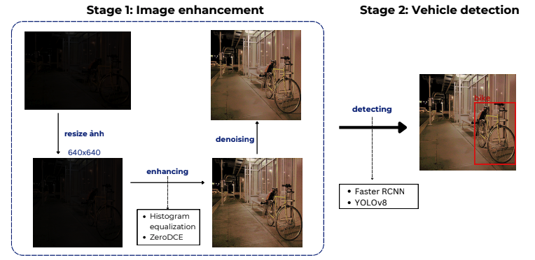

# 🚗 Detect Vehicles in Low-Light Conditions

In applications like surveillance, smart traffic systems, and autonomous vehicles, vehicle detection plays a crucial role. However, current systems often fail or degrade significantly under **low-light conditions** such as nighttime, tunnels, or bad weather.

This project — **"Detect Vehicles in Low-Light Conditions"** — aims to improve detection accuracy by combining **image enhancement (Zero-DCE)** with **object detection (YOLOv8 / Faster R-CNN)** for better visibility and safety in poor lighting environments.

---

## 📊 Processing Pipeline

<div align="center">
  
</div>

### 🧠 Stage 1: Image Enhancement
- The input image is usually very dark or noisy.
- The system first **resizes the image to 640×640**, then performs **enhancement** via:
  - Histogram Equalization
  - Zero-DCE (Deep Curve Estimation)
- Optionally, **denoising** is applied to clean the enhanced image.

### 🕵️‍♂️ Stage 2: Vehicle Detection
- Once the image is enhanced, it is passed into one of the detection models:
  - **YOLOv8** (default)
  - or **Faster R-CNN** (optional)
- Detected vehicles include: `car`, `bike`, `bus`, `truck`, `boat`.

---

## 🖥️ Deployment Architecture

The system is deployed using **FastAPI** and **Uvicorn**, enabling both human-friendly HTML upload and API-based interaction. Everything is packaged in Docker for fast deployment.

| Stage                | Component                   | Description                                           |
|----------------------|-----------------------------|-------------------------------------------------------|
| **1. Enhancement**   | Zero-DCE, Histogram EQ      | Brightens under-exposed images                        |
| **2. Detection**     | YOLOv8 / Faster R-CNN       | Identifies vehicles in the enhanced image             |
| **3. Web Service**   | FastAPI + Uvicorn           | REST + HTML interface for image upload and inference  |

---

## 🚀 Demo Instructions (Docker)

### 🔹 Step 1: Clone the Repository

```bash
git clone https://github.com/DatTran0509/Enhancing-and-Detecting-Vehicles-in-Low-Light-Conditions
```
### 🔹 Step 2: Build & Run the Service
```bash
docker-compose up --build
```
### 🔹 Step 3: Open the Web Interface
```bash
http://localhost:8000
```
### 🔹 Step 4: Stop the Service (when done)
```bash
docker-compose down
```